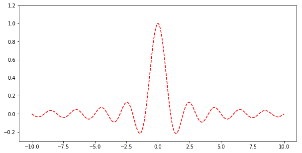

# 🗣️ Entrada, salida, verificación y operadores

## Game over

En los videojuegos, es común que cuando se pierde un juego se imprima Game Over. Usted es parte de un equipo de videojuegos, en el cual le encargan mostrar un mensaje cuando se termina el juego. Imprima un mensaje de `Game over`.

**Ejemplo:**

**Salida:**

```{bash}
Game over
```

### Swap

Como parte de la edición de artículos, es común mover el orden de oraciones, párrafos y secciones para mejorar la estructura y legibilidad del artículo. Por lo tanto una compañía editorial decide crear un programa que obtiene dos textos e imprime el resultado de darle vuelta al orden de los textos. Es decir, imprime el primer mensaje de segundo y el segundo de primero.

**Ejemplo:**

**Entrada**

```{bash}
Primer texto: Soy el primer mensaje
Segundo texto: Soy el segundo mensaje
```

**Salida:**

```{bash}
Soy el segundo mensaje
Soy el primer mensaje
```

## Logaritmo natural

En las matemáticas, una función logarítmica es la función inversa a la exponente. Queremos crear un programa que nos calcule al $$y$$ de la función logarítmica dado un $$x$$. Implemente un programa que pueda calcular el logaritmo natural de un número. Además, debe manejar el caso de la indefinición cuando los números son menores o iguales a 0.

**Ejemplo 1:**

```{bash}
Ingrese un número: 20
El logaritmo de 20 es 2.9957.
```

**Ejemplo 2:**

```{bash}
Ingrese un número: -10
El logaritmo se indefine.
```

**Nota:** Se calcula en Python el logaritmo con la función `log(número)}`. Para usar la función se debe importar mediante el siguiente encabezado `from math import log` al inicio del programa.

## PH

Con la Revolución Industrial, empezó el uso del carbón como fuente de energía. Incluso en la actualidad, el carbón es fuente de electricidad en varios países avanzados.  
Desde mediados del siglo XIX, se sabe que el oxígeno usado en el proceso de quema se combina con el carbono y el azufre del carbón, produciendo dióxido de carbono y dióxido de azufre. Cuando estos gases ascienden a la atmósfera, el dióxido de azufre se combina con el vapor de agua y el oxígeno en el aire, formando ácido sulfúrico. De este se separan iones de hidrógeno, que son los que cambian el nivel de acidez de la tierra y el agua cuando caen por medio de la lluvia.  
La acidez de los bosques y lagos se mide en pH utilizando la fórmula:

$$pH = - Log_{10}(\textnormal{concentración de iones de hidrógeno})$$  

La concentración de iones de hidrógeno típicamente se mide en $$mol/L$$. Un nivel de pH de 7 es neutral, inferior a 7 indica presencia de un ácido, y superior a 7 indica presencia de un alcalino. Note que en el caso de una concentración de 0 (o negativa), el logaritmo se indefine. En ese caso, asuma un pH de 14.

Escriba un programa que solicite una concentración de iones de hidrógeno en $$mol/L$$ y calcule el pH correspondiente. Además, muestre si es Ácido, Alcalino, o Neutral.

**Nota** En Python, el logaritmo base 10 se utiliza con `log10(numero)`. Para utilizarlo, debe agregar al inicio de su programa la línea `from math import log10`.

**Ejemplo 1:**

```{bash}
Ingrese la concentración de iones de hidrógeno (mol/L): 0.000001
Nivel de pH: 6.0
Es Alcalino:  False
Es Neutral:  False
Es Acido:  True
```

**Ejemplo 2:**

```{bash}
Ingrese la concentración de iones de hidrógeno (mol/L): 0
Nivel de pH: 14.0
Es Alcalino:  True
Es Neutral:  False
Es Acido:  False
```

**Ejemplo 3:**

```{bash}
Ingrese la concentracion de iones de hidrógeno (mol/L): NA
Nivel de pH: 14.0
Es Alcalino:  True
Es Neutral:  False
Es Acido:  False
```

## Transporte

Una profesora de primer grado quiere enseñar a sus estudiantes como reconocer distintos medios de transporte basados en la cantidad de ruedas que tiene. Ella propone la siguiente clasificación (no exhaustiva):

- **Carrito chocón:** 0 ruedas
- **Monociclo:** 1 rueda
- **Bicicleta:** 2 ruedas
- **Triciclo:** 3 ruedas
- **Automóvil:** 4 ruedas
- **Camión:** 5 o más ruedas

Implemente un programa que solicite la cantidad de ruedas de un vehículo y muestre cual de las categorías anteriores cumple.

**Ejemplo:**

```{bash}
Ingrese las ruedas del medio de transporte: 6
Es carrito chocon:  False
Es monociclo: False
Es bicicleta: False
Es triciclo: False
Es automovil: False
Es camion: True
```

## Seno cardinal

El seno cardinal (senc) es una función utilizada frecuentemente en el muestreo de señales. Esta función se define mediante la fórmula:

$$sinc(x) = \frac{sin(x \cdot \pi)}{x \cdot \pi}, \textnormal{donde x es un ángulo en radianes (sin pi)}$$

El comportamiento de esta función es similar a un coseno, pero mientras aumenta la preimagen, el coseno se empieza a acercar 0. La siguiente imagen muestra un gráfico del seno cardinal:



Algo importante de notar, es que esta función se indefine en 0, ya que se está realizando una división entre 0. Mediante el teorema de L’Hôpital, podemos calcular que $$senc(0) = 1$$.
  
- Cree un programa que pida un número y muestre el seno cardinal correspondiente. Muestrelo de la forma `sinc(0.0000) = 1.0000`, utilizando 4 decimales. Para resolver la indefinición en 0, puede utilizar el manejo de excepciones.
- Por propiedad del seno cardinal, este vale 0 cuando x es un número entero (menos 0). Pruebe su programa con los valores `-2, -1, 0, 1, 2`. Debería darle como resultado `0, 0, 1, 0, 0`.

**Nota** Seno en Python se calcula con la función `sin(numero)`, y el valor de pi se puede obtener con la variable `pi`. Para poder utilizar estos 2 valores, debe importarlos de la biblioteca math, para esto, agregue el encabezado `from math import sin, pi` al inicio del programa. Por ejemplo:

```{bash}
>>> from math import sin, pi
>>> seno = sin( pi/2 )
>>> print( seno )
1.0
```

## Coseno

Dado un ángulo en radianes $$x$$, el valor del coseno puede aproximarse mediante la siguiente sucesión de Taylor:

$$cos(x) = 1 - \frac{x^2}{2!} + \frac{x^4}{4!} - \frac{x^6}{6!} + \frac{x^8}{8!}$$

Escriba un programa al que se le ingrese un ángulo **en grados** y calcule la aproximación de su coseno mediante el polinomio de Taylor. Luego calcule el error: `valor_real - valor_aprox`. Utilice exactamente 6 decimales para mostrar el resultado, el valor real y el error.

Esta aproximación es válida para valores de $$-180$$ a $$180$$ (o $$-\pi$$ a $$\pi$$). Para valores fuera de este rango, va a topar con errores muy grandes.

**Nota** En Python, el coseno se utiliza con `cos(angulo)`. Para utilizarlo, debe agregar al inicio de su programa la línea `from math import cos`. Lo mismo para pi (lo ocupará para convertir de grados a radianes) y factorial (!):

```{bash}
>>> from math import pi, cos
>>> cos_real = cos( pi / 2 )
>>> print(cos_real)
6.123233995736766e-17
```

**Ejemplo:** Para un ángulo de 180 grados, su aproximación del coseno es -0.976022, y el error de aproximación es -0.023978 (ya que el coseno de 180 es -1).

```{bash}
Ingrese un ángulo en grados: 180
Coseno aproximado: -0.976022
Coseno real: -1.000000
Error de aproximación: -0.023978
```

## Tangente

Dado un ángulo en radianes $$x$$, el valor de la tangente puede aproximarse mediante la siguiente sucesión de Taylor:

$$tan(x) = x + \frac{x^3}{3} + \frac{2x^5}{15} + \frac{17x^7}{315} + \frac{62x^9}{2835}$$

Escriba un programa al que se le ingrese un ángulo **en grados** y calcule la aproximación de su tangente mediante el polinomio de Taylor. Luego calcule el error: `valor_real - valor_aprox`. Utilice exactamente 6 decimales para mostrar el resultado, el valor real y el error.

Esta aproximación es válida para valores de $$-90$$ a $$90$$  (o $$\frac{-\pi}{2}$$ a $$\frac{\pi}{2}$$). Para valores fuera de este rango, va a topar con errores muy grandes.

**Nota** En Python, la tangente se utiliza con `tan(angulo)`. Para utilizarlo, debe agregar al inicio de su programa la línea `from math import tan`. Lo mismo para pi (lo ocupará para convertir de grados a radianes)):

```{bash}
>>> from math import pi, tan
>>> tan_real = tan( pi / 4 )
>>> print(tan_real)
0.9999999999999999
```

**Ejemplo:** Para un ángulo de 45 grados, su aproximación de la tangente es 0.999171, y el error de aproximación es 0.000829 (ya que la tangente de 45 es 1.000000).

```{bash}
Ingrese un ángulo en grados: 45
Tangente aproximada: +0.999171
Tangente real: +1.000000
Error de aproximación: +0.000829
```

## Animales invertebrados

Los animales invertebrados son animales que no tienen vértebra
(i.e columna vertebral). Algunos animales invertebrados son las arañas, moluscos, cangrejos, gusanos, y hormigas. Estos tipos de animales se pueden clasificar (mayoritariamente) dependiendo la cantidad de patas que poseen. Las categorías que existen son:

- **Gusanos**: Tienen 0 patas.
- **Insectos**: Incluye animales como hormigas, cucarachas y mariposas. Todos tienen 6 patas.
- **Arácnidos**: Incluye animales como arañas y escorpiones. Tienen 8 patas.
- **Myriapodas**: Incluye animales como el ciempiés y el milpiés. Tienen de 10 a 1000 patas.

Escriba un programa que solicite la cantidad de patas que tiene un animal invertebrado y que clasifique el animal si es gusano, insecto, arácnido, o myriapoda.

**Ejemplo 1:**

```{bash}
El nombre del animal es: cucaracha
La cantidad de patas es: 6
Clasificación del animal invertebrado cucaracha...
Es gusano:  False
Es insecto:  True
Es aracnido:  False
Es myriapoda:  False
```

**Ejemplo 2:**

```{bash}
El nombre del animal es: escorpion
La cantidad de patas es: 8
Clasificación del animal invertebrado escorpión...
Es gusano:  False
Es insecto:  False
Es aracnido:  True
Es myriapoda:  False
```

**Ejemplo 3:**

```{bash}
El nombre del animal es: cienpies
La cantidad de patas es: 100
Clasificación del animal invertebrado cienpies...
Es gusano:  False
Es insecto:  False
Es aracnido:  False
Es myriapoda:  True
```

## Mamíferos

Existen distintas taxonomías de los animales, clasificándolos por medio de sus características y propiedades. Una clasificación de los animales son los mamíferos. Ejemplos de mamíferos incluyen los perros, delfines, osos y los seres humanos. Algunas características que tienen son:

- No tienen sangre fría
- Tienen glandulas mamárias
- Tienen pelo
- Tienen vértebra

Un grupo de profesores de un colegio de Costa Rica quiere crear un programa para ayudar a sus estudiantes a reconocer si un animal es o no es un mamífero. El programa recibe respuestas de si o no de las características de los mamíferos. Con las respuestas, indica si el animal es o no es un mamífero. Implemente el programa.

**Ejemplo 1:**

```{bash}
El nombre del animal es: Foca
Tiene sangre fría: No
Tiene glándulas mamarias: Si
Tiene pelo: Si
Tiene vertebra: Si
El animal Foca es mamífero: True
```

**Ejemplo 2:**

```{bash}
El nombre del animal es: Cangrejo
Tiene sangre fría: No
Tiene glándulas mamarias: Si
Tiene pelo: Si
Tiene vertebra: No
El animal Cangrejo es mamífero: False
```

**Ejemplo 3:**

```{bash}
El nombre del animal es: Tiburón
Tiene sangre fría: Si
Tiene glándulas mamarias: No
Tiene pelo: No
Tiene vertebra: Si
El animal Tiburón es mamífero: False
```

**Nota** Puede asumir que la entrada del usuario siempre es "Si" o "No". Si desea tener de entrada booleanos se recomienda utilizar la función [strtobool de la librería estándar](https://docs.python.org/3/distutils/apiref.html#distutils.util.strtobool) para convertir strings a booleanos.

## Referencias

- Villalobos, L. (2019). Tarea 2. Material del curso CI-0202, Universidad de Costa Rica.