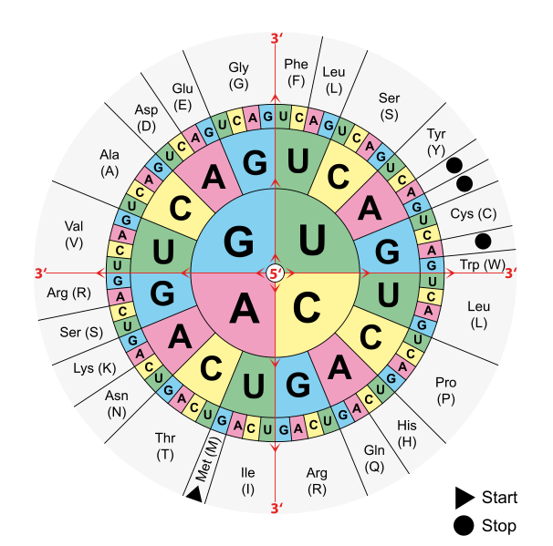

# 🔡 Hileras

## Contar palabras

Programe la función `contar_palabras` que cuenta cuántas palabras contiene una oración y devuelve la cantidad.

**Ejemplo:**

Invocar la funcion así:

```{bash}
cuenta_palabras("hola soy una oracion")
```

Devuelve:

```{bash}
4
```

## Quitar vocales

Programe la función `quitar_vocales` que quite las vocales de una hilera y devuelve la hilera resultante.

**Ejemplo:**

Invocar la funcion así:

```{bash}
quitar_vocales("Murcielago")
```

Devuelve:

```{bash}
Mrclg
```

## Revertir

Programe la función `revertir` que revierte la hilera y devuelve la hilera revertida.

**Ejemplo:**

Invocar la funcion así:

```{bash}
revertir("Hola Mundo")
```

Devuelve:

```{bash}
aloH odnuM
```

## Sacar iniciales

Programe sacar las iniciales de una persona, dado un nombre completo (nombre + apellidos). Maneje el caso de que le den una cantidad nombres y apellidos.

**Ejemplo:**

Para el string:

```{bash}
"John Smith"
```

Da:

```{bash}
"JS"
```

## Letras únicas

Implemente un método que permita determinar si todas las letras de un string son únicas.

**Ejemplo:**

Para el string:

```{bash}
"Banana"
```

Da:

```{bash}
false
```

## Abecederian

Una palabra es _abecederian_ si todas las letras de la palabra aparecen en orden alfabético. Puede asumir que se está usando el alfabeto en ingles.
Implemente un método que permita determinar si una palabra es _abecederian_.

**Ejemplo:**

Para la palabra:

```{bash}
"biopsy"
```

Da:

```{bash}
true
```

## Contar letras

Programe la función `contar_letras` que cuenta las ocurrencias de cada letra, sin diferenciar mayúsculas y minúsculas. La función devolvera una lista que cuenta cada letra. Luego programe la función `imprimir_cuenta_letras` que recibe la lista de la cuenta de cada letra e imprime el total de ocurrencias por letra.

**Ejemplo:**

Invocar la funciones así:

```{bash}
lista_cuenta = contar_letras("La casa de ana tiene fugas")
imprimir_cuenta_letras(lista_cuenta)
```

Imprime:

```{bash}
A = 6
B = 0
C = 1
D = 1
E = 3
F = 1
G = 1
H = 0
I = 1
J = 0
K = 0
L = 1
M = 0
N = 2
O = 0
P = 0
Q = 0
R = 0
S = 2
T = 1
U = 1
V = 0
W = 0
X = 0
Y = 0
Z = 0
```

## Quimera

La maestría de Bioinformática de la UCR lo ha contactado para ayudarles con su investigación nodriza: analizar cómo funciona el genoma humano. Si recuerdan, el ADN (Ácido desoxiribonucléico) de las personas son una helice doble con una serie de bases: Adenina (A), Citosina (C), Guanina (G) y Tiamina (T). Las bases eran complementarias de una hélice con otra. O sea, si en una hay una A, en el otro lado hay una T; y lo mismo con G y C.

En la computadora, se puede representar una secuencia de ADN mediante una hilera de texto:

```{bash}
GTGCATCTGACTCCTGAGGAGAAG
```

El ADN es el código fuente de los seres vivos. Básicamente, el ADN se utiliza para generar proteinas, que están encargadas de todas las funciones de la célula. Las proteínas están compuestas por secuencias de amino ácidos, que, en contraste al ADN son actualmente 21. Por dar un ejemplo, de algunos de los genes del cromosoma 11 se genera la famosa insulina, relacionada con los niveles de azúcar de la sangre.

En la maestría de Bioinformática le han solicitado que programe un simulador de este proceso de conversión de ADN en una proteína. Este proceso consiste de dos partes:

- **Transcripción:** Conversión de ADN a ARN
- **Traducción:** Conversión de ARN a una proteína

El proceso de **transcripción** ocurre cuando una célula, llamada polimerasa, hace una copia del ADN en el núcleo de la célula en un formato llamado ARN. Haciendo la analogía a la programación con la que estamos familiarizados, esto es similar a cuando se compila el programa. La diferencia de ADN a ARN es una simplemente, la Tiamina (T) se cambia por el Uracilo (U). Si hacemos este cambio en la cadena de ADN:

```{bash}
GTGCATCTGACTCCTGAGGAGAAG
```

obtenemos el siguiente ARN:

```{bash}
GUGCAUCUGACUCCUGAGGAGAAG
```

El proceso de **traducción** convierte el ARN en una cadena de amino ácidos que conforman una proteína. Esto es realizado por una estructura llamada ribosoma. La traducción es muy diferente al proceso anterior. Este proceso toma grupos de 3 bases nitrogenadas, elije el amino ácido correspondiente a esas bases, y la "agrega" a la cadena de amino ácidos. Haciendo la analogía a la programación, esto es ejecutar el programa, cuando la computadora va interpretando las instrucciones que le escribimos como acciones.

La siguiente figura contiene todas las posibles triadas de bases y el amino ácido que les corresponde:



Entonces por ejemplo, la secuencia CUC se transformaría en el amino ácido Leucina (L). Si aplicamos este ejemplo a la cadena de ARN que teníamos antes:

```{bash}
GUGCAUCUGACUCCUGAGGAGAAG
```

obtenemos la siguiente proteína:

```{bash}
V H L T P E E K
```

Finalmente, hay un par de reglas adicionales a este proceso:

- Toda proteína empieza con la metionina (M). Dicho de otra manera, en el proceso de transcripción todo el ARN se ignora, hasta llegar a la combinación `AUG`.
- Existen 3 secuencia que, en lugar de agregar un amino ácido a la proteína, termina el proceso de transcripción. Estas son las que en la tabla están codificadas como Stop.

Implemente entonces un programa al que se le ingrese una cadena de ADN, revise que esta sea válida, realice sobre esta los procesos de transcripción y traducción, y que muestre la proteína ensamblada.

**Ejemplo:**

Para la cadena de ADN:

```{bash}
ATGGTGCATCTGTAAACTCCTGAGGAGAAG
```

Da:

```{bash}
ARN: AUGGUGCAUCUGUAAACUCCUGAGGAGAAG
Amino acidos: MVH
```

## Referencias

- Villalobos, L. (2019a). Ejercicios clase 11. Material del curso CI-0202, Universidad de Costa Rica.
- Villalobos, L. (2019b). Hileras. Material del curso CI-0202 Universidad de Costa Rica de Leonardo
Villalobos.
- Downey, A. B., y Mayfield, C. (2020). Think Java: How to Think Like a Computer Scientist (Second
edition ed.).
- Eck, D. J. (2020). Introduction to programming using Java (Eighth edition ed.). Geneva (NY): Hobart
and William Smith Colleges, Department of mathematics and computer science.
- Elkner, J., Downey, A. B., y Meyers, C. (2012). How to think like a computer scientist: Learning with
python.
