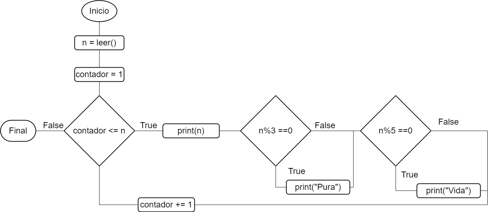

# 🔁 Flujos de control: Soluciones

## Par o impar 🔢

### Versión 1

### Versión 2

## Tablas ⏹️

### For

### While

## Entrada válida 🎫

## Promedio ➗

### While

### For

## Pura vida

## Notas 📄

  Los diagramas que realizamos de diseño son llamados diagramas de flujo. Para leer más sobre ellos, pueden ver en el siguiente enlace: https://www.lucidchart.com/pages/es/que-es-un-diagrama-de-flujo.

  Los IDE's tienen muchas atajos que podemos utilizar apretando distintas teclas (hotkeys). Pueden ver para el caso de Visual Studio Code los atajos en el siguiente enlace: https://code.visualstudio.com/docs/getstarted/tips-and-tricks#_keyboard-reference-sheets. Algunos de los que yo utilizo comunment son: 
  - Ctrl + S : Guardar  
  - Ctrl + C : Copiar  
  - Ctrl + X : Cortar  
  - Ctrl + V : Pegar  
  - Ctrl + K Ctrl + C : Añadir comentario a la línea  
  - Ctrl + K Ctrl + U : Quitar comentario a la línea

